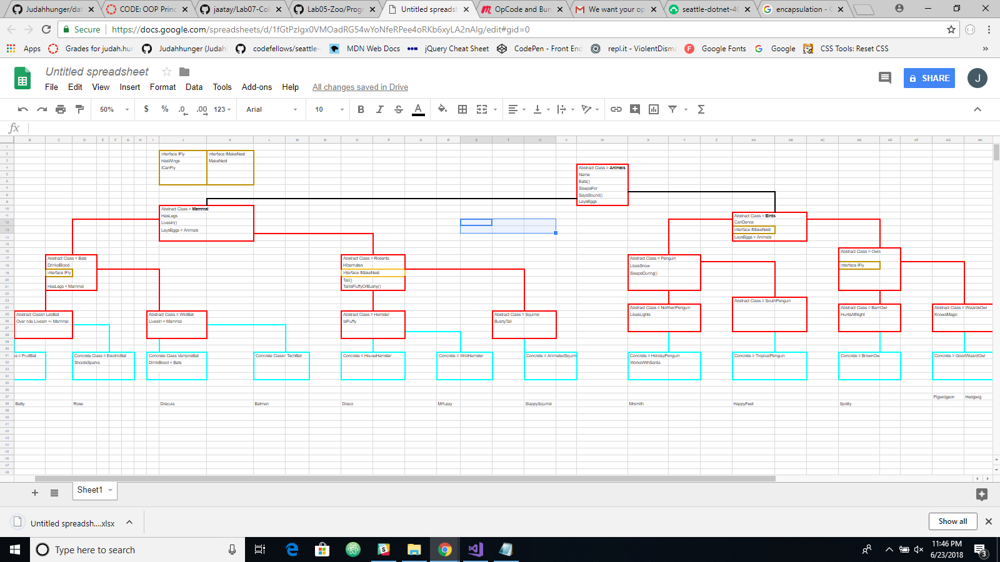
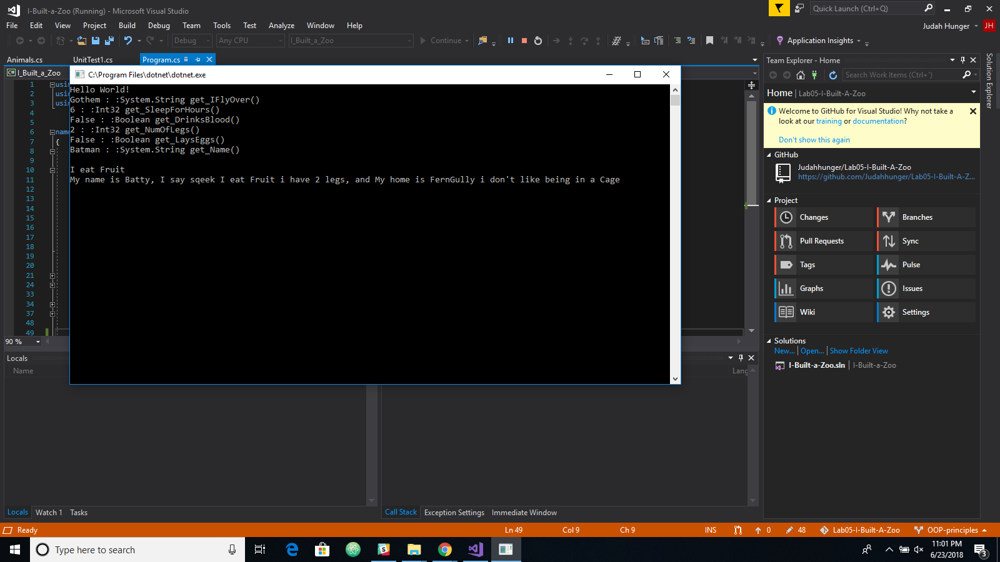

# Lab05-I-Built-A-Zoo
**Author**:Judah Hunger
**Version**: 1.0.0 

## Overview
Project to create a better understanding of how OOP Principles work.
- Making Abstract classes and showing inheritance, abstraction, polymorphism, and encapsulation.

## Example

## OOP
- Inheritance to me is like genes having properties from something else to make the new thing.
- Abstraction to me is an porperty that you have to fill in the blank by the time you hit a concrete class. You have to set a value.
- Polymorphism is having a value already set in place but can change or keep the value you decide.
- Encapsulation is like saying hey you can swim but you have to be in the swimming area.

